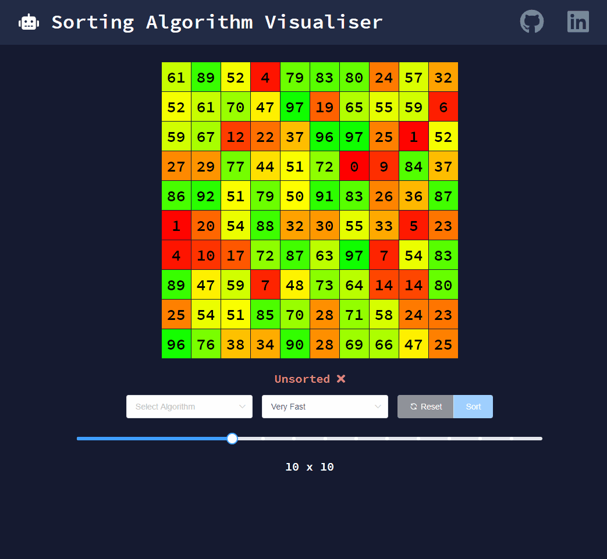

# Sorting Algorithm Visualiser

Visualise some common sorting algorithms on a colourful, re-sizable grid. 

Built with ❤️ using [Vue.js](https://vuejs.org/).

## Features
* 🔥 Colourful, visually stimulating grid

* 🔥 Resizable grid dimensions

* 🔥 6 algorithms: Bubble, Insertion, Selection, Radix, Heap, Counting

## Demonstration

